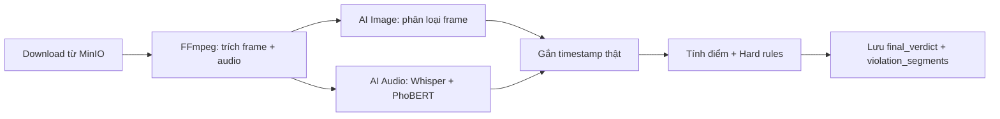

# Cách đánh giá video trong Vidio Guard

Tài liệu này mô tả **toàn bộ quy trình đánh giá nội dung video** — từ khi video được tải lên đến khi hệ thống trả về `verdict` (safe / warning / violation), `risk_score`, và các đoạn vi phạm theo thời gian.

---

## 1. Tổng quan luồng xử lý

Khi một video được upload, backend đưa job vào hàng đợi (Asynq). Worker gọi `VideoProcessingService.Process`, thực hiện các bước:



Điểm vào chính:

```55:89:server/internal/services/video_processing_service.go
func (s *videoProcessingService) Process(ctx context.Context, videoID uuid.UUID, objectKey string) error {
	// ...
	output, err := s.processor.Process(ctx, job, s.progress)
	// ...
	if err := s.persistResults(ctx, videoID, output); err != nil {
		// ...
	}
	return s.progress.MarkCompleted(ctx, videoID)
}
```

Kết quả được lưu trong `persistResults`:

```124:151:server/internal/services/video_processing_service.go
func (s *videoProcessingService) persistResults(ctx context.Context, videoID uuid.UUID, output *dto.ProcessingOutput) error {
	// ...
	verdict := buildFinalVerdict(videoID, output.Frames, output.Audio, durationSec, s.scorer)
	if err := s.verdicts.Create(ctx, verdict); err != nil {
		return fmt.Errorf("save final verdict: %w", err)
	}

	segments := buildViolationSegments(videoID, output.Frames, output.Audio)
	if err := s.violations.CreateBatch(ctx, segments); err != nil {
		return fmt.Errorf("save violation segments: %w", err)
	}
	// ...
}
```

---

## 2. Tiền xử lý video (FFmpeg)

### 2.1 Trích xuất frame hình ảnh

Video được xử lý song song: **trích frame** và **trích audio**.

- **Target FPS** = `originalFPS / 3` (tối thiểu 1 fps).
- Bộ lọc FFmpeg kết hợp giảm fps + chọn frame theo **scene change** và **mỗi 10 frame**:

```44:68:server/internal/services/video_processor.go
	originalFPS, err := utils.GetVideoFPS(job.VideoPath)
	// ...
	targetFPS := int(originalFPS / 3)
	if targetFPS < 1 {
		targetFPS = 1
	}

	vfFilter := fmt.Sprintf("fps=%d,select='gt(scene,0.3)+not(mod(n,10))',showinfo", targetFPS)
	framesPattern := filepath.Join(framesDir, "frame_%05d.jpg")
	frameArgs := []string{
		"-i", job.VideoPath,
		"-vf", vfFilter,
		"-vsync", "vfr",
		"-q:v", "2",
		framesPattern,
	}
```

**Ý nghĩa:** Không lấy mọi frame gốc (quá nặng), mà lấy mẫu đại diện — ưu tiên cảnh thay đổi mạnh và frame định kỳ — để AI phân tích nhanh hơn mà vẫn bắt được nội dung rủi ro.

### 2.2 Trích xuất audio

Audio được chuẩn hóa về **mono 16 kHz WAV** (phù hợp Whisper + PhoBERT):

```70:85:server/internal/services/video_processor.go
	audioOut := filepath.Join(audioDir, "audio.wav")
	audioArgs := []string{
		"-hide_banner",
		"-loglevel", "error",
		"-fflags", "+genpts",
		"-i", job.VideoPath,
		"-map", "0:a:0?",
		"-vn",
		"-af", "pan=mono|c0=0.5*c0+0.5*c1,highpass=f=80,dynaudnorm=f=150:g=15,aresample=16000:resampler=swr,aformat=sample_fmts=s16:channel_layouts=mono",
		"-ar", "16000",
		"-ac", "1",
		"-c:a", "pcm_s16le",
		"-f", "wav",
		"-y",
		audioOut,
	}
```

### 2.3 Frame manifest — timestamp thật (PTS)

Mỗi frame được gắn **thời điểm thật trong video** (giây), lấy từ stderr `showinfo` của FFmpeg hoặc ước lượng theo thứ tự frame:

```176:211:server/internal/services/video_processor.go
func buildFrameManifest(framesDir, ffmpegStderr string, videoDurationSec float64, targetFPS int) (*dto.FrameManifest, error) {
	// ...
	ptsTimes := utils.ParseShowinfoPTSTimes(ffmpegStderr)
	// ...
	for i, name := range frameFiles {
		ts := float64(i) / float64(targetFPS)
		if i < len(ptsTimes) {
			ts = ptsTimes[i]
		}
		manifest.Frames = append(manifest.Frames, dto.FrameManifestEntry{
			File:         name,
			TimestampSec: ts,
		})
	}
	return manifest, nil
}
```

Timestamp này rất quan trọng: **mọi điểm số và hard rule đều tính theo giây thật**, không chỉ đếm số frame.

---

## 3. Phân tích hình ảnh (Image Moderation)

### 3.1 Gọi AI service

Backend gửi frame theo **chunk** (mặc định 32 frame/lần) tới `image-moderation`:

```43:99:server/internal/services/ai_service.go
func (a *aiModerator) PredictFramesDir(videoID, framesDir string) (*dto.PredictionResult, error) {
	// ...
	for chunkIdx := range totalChunks {
		// ...
		preds, err := a.predictFrameChunk(chunk)
		// ...
		for _, p := range preds {
			result.Predictions = append(result.Predictions, p)
			result.Total++
			if dto.IsFlaggedFrameLabel(p.Label) {
				result.FlaggedCount++
			}
		}
	}
	result.OverallLabel = dto.OverallFrameLabel(result.Predictions)
	return result, nil
}
```

### 3.2 Model và logic gán nhãn

Service `image-moderation` dùng **EfficientNet** với 3 lớp: `safe`, `nsfw`, `violence`.

Quy tắc gán nhãn (ưu tiên ngưỡng trước argmax):

```88:100:image-moderation/app/model.py
        if prob_map.get("nsfw", 0.0) > thr_nsfw:
            predicted_label = "nsfw"
        elif prob_map.get("violence", 0.0) > thr_violence:
            predicted_label = "violence"
        else:
            predicted_label = "safe"

        results.append({
            "label":      predicted_label,
            "confidence": prob_map[predicted_label],
            "scores":     prob_map,
        })
```

Ngưỡng mặc định (có thể cấu hình qua env):

| Biến môi trường | Mặc định |
|----------------|----------|
| `AI_NSFW_THRESHOLD` | 0.6 |
| `AI_VIOLENCE_THRESHOLD` | 0.6 |

### 3.3 Nhãn nào được coi là "vi phạm"?

```64:86:server/internal/dto/ai_moderation_dto.go
func IsFlaggedFrameLabel(label string) bool {
	return label == "nsfw" || label == "violence"
}

func OverallFrameLabel(predictions []FrameResult) string {
	hasViolence := false
	for _, p := range predictions {
		if p.Label == "nsfw" {
			return "nsfw"
		}
		if p.Label == "violence" {
			hasViolence = true
		}
	}
	if hasViolence {
		return "violence"
	}
	return "safe"
}
```

**Thứ tự ưu tiên overall:** `nsfw` > `violence` > `safe`.

### 3.4 Gắn timestamp vào kết quả AI

Sau khi AI trả về, backend enrich timestamp từ manifest:

```231:253:server/internal/services/frame_timeline.go
func enrichFrameTimestamps(result *dto.PredictionResult, manifest *dto.FrameManifest) {
	// ...
	for i := range result.Predictions {
		p := &result.Predictions[i]
		if ts, ok := manifest.TimestampForFile(p.Frame); ok {
			p.TimestampSec = ts
			continue
		}
		num := parseFrameNumber(p.Frame)
		p.TimestampSec = float64(num-1) / targetFPS
	}
}
```

---

## 4. Phân tích âm thanh (Audio Moderation)

### 4.1 Pipeline

1. **faster-whisper** chuyển audio → các câu có `start_sec`, `end_sec`, `text`.
2. **PhoBERT** phân loại từng câu: `Clean` hoặc `Toxic`.

```38:78:audio-moderation/app/routers/predict.py
async def predict_audio(file: UploadFile = File(...)) -> AudioPredictResponse:
    # ...
    segments = transcribe_audio(tmp_path)
    # ...
    texts = [s.text for s in segments]
    preds = phobert.predict(texts)

    sentence_results: list[SentencePrediction] = [
        SentencePrediction(
            text=seg.text,
            start_sec=seg.start_sec,
            end_sec=seg.end_sec,
            **pred,
        )
        for seg, pred in zip(segments, preds)
    ]

    flagged = sum(1 for s in sentence_results if s.label in FLAGGED_LABELS)
```

### 4.2 Nhãn audio được coi là vi phạm

```68:70:server/internal/dto/ai_moderation_dto.go
func IsFlaggedAudioLabel(label string) bool {
	return label == "Toxic"
}
```

Mỗi câu Toxic mang theo khoảng thời gian thật (`StartSec`, `EndSec`) — dùng cho scoring và hard rules.

---

## 5. Dựng timeline hình ảnh

Trước khi tính điểm, mỗi frame prediction được chuyển thành **VisualEvent** (sự kiện theo thời gian):

```44:97:server/internal/services/frame_timeline.go
func BuildVisualEvents(predictions []dto.FrameResult, targetFPS float64) []VisualEvent {
	defaultSpan := 1.0 / targetFPS
	maxSpan := 2.0 / targetFPS
	// ...
	for i, it := range items {
		span := defaultSpan
		if i+1 < len(items) {
			gap := items[i+1].ts - it.ts
			if gap > 0 && gap < maxSpan {
				span = gap
			}
		}
		it.ev.SpanSec = span
		out[i] = it.ev
	}
	return out
}
```

**`SpanSec`**: độ dài mà frame đó "đại diện" trên timeline — thường là khoảng cách tới frame kế tiếp, hoặc `1/targetFPS` nếu là frame cuối.

Các event cùng nhãn gần nhau được **merge** thành interval liên tục:

```99:151:server/internal/services/frame_timeline.go
func MergeVisualIntervals(events []VisualEvent, label string, gapSec, minConf float64) []VisualInterval {
	// Lọc theo label + minConf
	// Nếu 2 event cách nhau <= gapSec → gộp thành 1 interval
	// Tính AvgConf (trung bình có trọng số theo thời gian) và PeakConf
}
```

Tham số `gapSec` mặc định: **0.5 giây** (`MOD_VISUAL_MERGE_GAP_SEC`).

---

## 6. Tính điểm rủi ro (Risk Scoring)

Logic chính nằm trong `ModerationScorer.BuildFinalVerdict`:

```30:73:server/internal/services/moderation_scorer.go
func (s *ModerationScorer) BuildFinalVerdict(
	videoID uuid.UUID,
	frames *dto.PredictionResult,
	audio *dto.AudioResult,
	videoDurationSec float64,
) *model.FinalVerdict {
	// ...
	frameScore := s.computeFrameScore(frames, duration)
	audioScore := s.computeAudioScore(audio, duration)
	finalScore := s.fuse(frameScore, audioScore)
	if audioScore > finalScore {
		finalScore = audioScore
	}

	reason := s.evaluateHardRules(frames, audio, duration)
	verdict := s.verdictFromScore(finalScore)
	if reason != "" {
		verdict = constants.VerdictViolation
		if finalScore < s.cfg.HardRuleFloorScore {
			finalScore = s.cfg.HardRuleFloorScore
		}
	}
	// ...
}
```

### 6.1 Frame Score

```75:95:server/internal/services/moderation_scorer.go
func (s *ModerationScorer) computeFrameScore(frames *dto.PredictionResult, videoDurationSec float64) float64 {
	events := BuildVisualEvents(frames.Predictions, targetFPS)
	nsfwIntervals := MergeVisualIntervals(events, labelNsfw, gap, 0)
	violenceIntervals := MergeVisualIntervals(events, labelViolence, gap, 0)

	coverageNsfw := visualCoverageScore(nsfwIntervals, videoDurationSec)
	coverageViolence := visualCoverageScore(violenceIntervals, videoDurationSec)
	peak := visualPeakWindowScore(events, s.cfg.VisualPeakWindowSec, s.cfg.MaxLabelWeight)

	return clamp01(maxFloat(coverageNsfw, maxFloat(coverageViolence, peak)))
}
```

Frame score = **max** của 3 thành phần:

#### A. Coverage NSFW / Violence

Công thức:

```
coverage = (tổng_giây_interval_merged / video_duration) × confidence_trung_bình
```

Code:

```153:170:server/internal/services/frame_timeline.go
func visualCoverageScore(intervals []VisualInterval, videoDurationSec float64) float64 {
	var totalDur, confSum float64
	for _, iv := range intervals {
		d := iv.EndSec - iv.StartSec
		totalDur += d
		confSum += iv.AvgConf * d
	}
	return clamp01((totalDur / videoDurationSec) * (confSum / totalDur))
}
```

**Ví dụ:** Video 100 giây, NSFW xuất hiện liên tục 10 giây với confidence TB 0.8 → coverage ≈ `(10/100) × 0.8 = 0.08`.

#### B. Peak window (cửa sổ đỉnh 3 giây)

Quét mọi cửa sổ 3 giây, tính mật độ vi phạm có trọng số:

```172:218:server/internal/services/frame_timeline.go
func visualPeakWindowScore(events []VisualEvent, windowSec, maxWeight float64) float64 {
	// weightedSum += weight(label) × confidence × spanSec
	// raw = weightedSum / windowSec
	// score = normalize(raw, maxWeight)  → clamp [0, 1]
}
```

**Trọng số nhãn:**

```13:20:server/internal/services/moderation_scorer.go
const (
	weightSafe     = 0
	weightNsfw     = 4
	weightViolence = 5
)
```

Violence nặng hơn NSFW trong cửa sổ ngắn — phù hợp khi bạo lực xuất hiện dồn dập trong vài giây.

### 6.2 Audio Score

```97:108:server/internal/services/moderation_scorer.go
func (s *ModerationScorer) computeAudioScore(audio *dto.AudioResult, durationSec float64) float64 {
	toxicDur, avgConf, _ := toxicAudioStats(audio)
	coverageScore := (toxicDur / durationSec) * avgConf
	peakScore := audioPeakWindowScore(audio, durationSec, s.cfg.AudioPeakWindowSec)
	return clamp01(maxFloat(coverageScore, peakScore))
}
```

Audio score = **max** của:

| Thành phần | Công thức |
|------------|-----------|
| **Coverage** | `(giây_toxic_merged / duration) × confidence_TB` |
| **Peak 10s** | Mật độ toxic cao nhất trong cửa sổ 10 giây |

Các câu Toxic được merge nếu cách nhau ≤ 2 giây (`mergeToxicSpans`).

### 6.3 Fusion — gộp frame + audio

```162:169:server/internal/services/moderation_scorer.go
func (s *ModerationScorer) fuse(frameScore, audioScore float64) float64 {
	fw := s.cfg.FrameWeight   // mặc định 0.7
	aw := s.cfg.AudioWeight   // mặc định 0.3
	return (fw*frameScore + aw*audioScore) / (fw + aw)
}
```

Sau fusion, hệ thống lấy **max(fuse, audioScore)**:

```48:51:server/internal/services/moderation_scorer.go
	finalScore := s.fuse(frameScore, audioScore)
	if audioScore > finalScore {
		finalScore = audioScore
	}
```

**Lý do:** Lời nói toxic có thể ngắn nhưng nghiêm trọng — audio không bị "pha loãng" bởi trọng số frame thấp.

### 6.4 Chuyển điểm → Verdict

```171:179:server/internal/services/moderation_scorer.go
func (s *ModerationScorer) verdictFromScore(score float64) constants.ModerationVerdict {
	if score < s.cfg.SafeThreshold {       // < 0.25
		return constants.VerdictSafe
	}
	if score < s.cfg.ViolationThreshold {  // < 0.55
		return constants.VerdictWarning
	}
	return constants.VerdictViolation      // >= 0.55
}
```

| `risk_score` | `verdict` |
|--------------|-----------|
| `< 0.25` | `safe` |
| `0.25 – 0.55` | `warning` |
| `≥ 0.55` | `violation` |

Ba mức verdict:

```5:9:server/internal/constants/moderation.go
const (
	VerdictSafe       ModerationVerdict = "safe"
	VerdictWarning    ModerationVerdict = "warning"
	VerdictViolation  ModerationVerdict = "violation"
)
```

API trả `violated = true` khi `verdict != "safe"` (gồm cả `warning`).

---

## 7. Hard Rules — quy tắc cứng

Hard rules **bỏ qua ngưỡng điểm mềm**: nếu kích hoạt → verdict luôn là `violation`, và `risk_score` tối thiểu **0.85**.

```53:60:server/internal/services/moderation_scorer.go
	reason := s.evaluateHardRules(frames, audio, duration)
	verdict := s.verdictFromScore(finalScore)
	if reason != "" {
		verdict = constants.VerdictViolation
		if finalScore < s.cfg.HardRuleFloorScore {
			finalScore = s.cfg.HardRuleFloorScore
		}
	}
```

Thứ tự kiểm tra:

```181:198:server/internal/services/moderation_scorer.go
func (s *ModerationScorer) evaluateHardRules(...) string {
	if reason := s.hardRuleNsfwSustained(frames); reason != "" { return reason }
	if reason := s.hardRuleViolenceSustained(frames); reason != "" { return reason }
	if reason := s.hardRuleViolenceBurst(frames); reason != "" { return reason }
	if reason := s.hardRuleToxicSustained(audio); reason != "" { return reason }
	if reason := s.hardRuleToxicAggregate(audio, videoDurationSec); reason != "" { return reason }
	return ""
}
```

### Bảng hard rules (giá trị mặc định)

| Mã | Điều kiện | Env liên quan |
|----|-----------|---------------|
| `nsfw_sustained` | NSFW conf ≥ 0.90, span merged ≥ 5 giây | `MOD_HARD_NSFW_CONF`, `MOD_HARD_NSFW_SEC` |
| `violence_sustained` | Violence conf ≥ 0.85, span merged ≥ 2 giây | `MOD_HARD_VIOLENCE_CONF`, `MOD_HARD_VIOLENCE_SEC` |
| `violence_burst` | ≥ 3 frame violence trong 3 giây, conf TB ≥ 0.80 | `MOD_HARD_VIOLENCE_BURST_COUNT`, `MOD_HARD_VIOLENCE_BURST_CONF` |
| `toxic_sustained` | Toxic liên tục (merged) ≥ 15 giây | `MOD_HARD_TOXIC_SEC` |
| `toxic_many_segments` | ≥ 8 câu Toxic, conf TB ≥ 0.85 | `MOD_HARD_TOXIC_SEGMENTS` |
| `toxic_total_duration` | Tổng giây toxic merged ≥ 30 giây | `MOD_HARD_TOXIC_TOTAL_SEC` |
| `toxic_coverage_ratio` | Toxic ≥ 15% thời lượng video | `MOD_HARD_TOXIC_COVERAGE` |

Ví dụ rule NSFW:

```221:230:server/internal/services/moderation_scorer.go
func (s *ModerationScorer) hardRuleNsfwSustained(frames *dto.PredictionResult) string {
	intervals := MergeVisualIntervals(events, labelNsfw, s.cfg.VisualMergeGapSec, s.cfg.HardNsfwConfidence)
	for _, iv := range intervals {
		if iv.EndSec-iv.StartSec >= s.cfg.HardNsfwSec {
			return "nsfw_sustained"
		}
	}
	return ""
}
```

Ví dụ rule violence burst:

```247:285:server/internal/services/moderation_scorer.go
func (s *ModerationScorer) hardRuleViolenceBurst(frames *dto.PredictionResult) string {
	// Quét cửa sổ 3 giây
	// Đếm frame violence có conf >= 0.80
	// Nếu count >= 3 và conf TB >= 0.80 → "violence_burst"
}
```

---

## 8. Violation Segments — đoạn vi phạm theo thời gian

Ngoài verdict tổng, hệ thống lưu **từng đoạn vi phạm** để frontend hiển thị timeline.

```23:46:server/internal/services/violation_segment_builder.go
func buildViolationSegments(videoID uuid.UUID, frames *dto.PredictionResult, audio *dto.AudioResult) []model.ViolationSegment {
	// Visual: merge interval nsfw → category "nudity", violence → "violence"
	// Audio: mỗi câu Toxic → category "hate_speech"
}
```

Visual segments:

```48:79:server/internal/services/violation_segment_builder.go
func buildVisualViolationSegments(frames *dto.PredictionResult) []interval {
	events := BuildVisualEvents(frames.Predictions, targetFPS)
	for _, label := range []string{labelNsfw, labelViolence} {
		merged := MergeVisualIntervals(events, label, gap, 0)
		// startSec, endSec, peakScore = PeakConf
	}
	return mergeIntervals(points, gap)
}
```

Audio segments: mỗi câu Toxic thành một đoạn, sau đó merge nếu cùng category và gần nhau (gap 0.5s).

**Lưu ý:** Violation segments dùng để **hiển thị**, không quyết định verdict — verdict do `ModerationScorer` tính.

---

## 9. Dữ liệu lưu trữ

Bảng `final_verdicts`:

```5:17:server/internal/model/final_verdict.go
type FinalVerdict struct {
	VideoID           uuid.UUID
	Verdict           string    // safe | warning | violation
	RiskScore         float64   // điểm cuối [0, 1]
	FrameScore        float64
	AudioScore        float64
	TotalFrames       int
	VideoDurationSec  float64
	HardRuleTriggered bool
	HardRuleReason    string    // mã hard rule, rỗng nếu không kích hoạt
}
```

---

## 10. Cấu hình đầy đủ

Tất cả tham số scoring có thể override qua biến môi trường:

```178:198:server/internal/config/config.go
		Moderation: ModerationConfig{
			FrameWeight:              getenvFloat("MOD_FRAME_WEIGHT", 0.7),
			AudioWeight:                getenvFloat("MOD_AUDIO_WEIGHT", 0.3),
			SafeThreshold:              getenvFloat("MOD_SAFE_THRESHOLD", 0.25),
			ViolationThreshold:         getenvFloat("MOD_VIOLATION_THRESHOLD", 0.55),
			MaxLabelWeight:             getenvFloat("MOD_MAX_LABEL_WEIGHT", 5),
			HardRuleFloorScore:         getenvFloat("MOD_HARD_RULE_FLOOR", 0.85),
			HardNsfwConfidence:         getenvFloat("MOD_HARD_NSFW_CONF", 0.90),
			HardNsfwSec:                 getenvFloat("MOD_HARD_NSFW_SEC", 5),
			HardViolenceSec:            getenvFloat("MOD_HARD_VIOLENCE_SEC", 2.0),
			HardViolenceConfidence:     getenvFloat("MOD_HARD_VIOLENCE_CONF", 0.85),
			HardViolenceBurstCount:     getenvInt("MOD_HARD_VIOLENCE_BURST_COUNT", 3),
			HardViolenceBurstConf:      getenvFloat("MOD_HARD_VIOLENCE_BURST_CONF", 0.80),
			VisualMergeGapSec:          getenvFloat("MOD_VISUAL_MERGE_GAP_SEC", 0.5),
			VisualPeakWindowSec:        getenvFloat("MOD_VISUAL_PEAK_WINDOW_SEC", 3.0),
			AudioPeakWindowSec:         getenvFloat("MOD_AUDIO_PEAK_WINDOW_SEC", 10.0),
			HardToxicSec:               getenvFloat("MOD_HARD_TOXIC_SEC", 15),
			HardToxicCoverageRatio:     getenvFloat("MOD_HARD_TOXIC_COVERAGE", 0.15),
			HardToxicSegmentCount:      getenvInt("MOD_HARD_TOXIC_SEGMENTS", 8),
			HardToxicTotalSec:          getenvFloat("MOD_HARD_TOXIC_TOTAL_SEC", 30),
		},
```

---

## 11. Sơ đồ quyết định cuối cùng

```mermaid
flowchart TD
  start[Kết quả Frame + Audio] --> fs[frame_score]
  start --> as[audio_score]
  fs --> fuse["fuse = 0.7×frame + 0.3×audio"]
  as --> fuse
  fuse --> final["final = max(fuse, audio_score)"]
  final --> hard{Hard rule?}
  hard -->|Có| viol[verdict = violation<br/>risk_score = max(final, 0.85)]
  hard -->|Không| thresh{So sánh ngưỡng}
  thresh -->|"< 0.25"| safe[safe]
  thresh -->|"0.25 – 0.55"| warn[warning]
  thresh -->|"≥ 0.55"| viol2[violation]
```

---

## 12. Ví dụ minh họa

### Ví dụ 1: Video an toàn

- 200 frame, tất cả `safe`
- 50 câu audio, tất cả `Clean`
- Video dài 120 giây

→ `frame_score = 0`, `audio_score = 0`, `risk_score = 0`, `verdict = safe`

### Ví dụ 2: Cảnh báo nhẹ

- 3 frame `violence` rải rác (tổng ~2 giây merged), conf TB 0.7
- Video 60 giây, không toxic audio

→ coverage_violence ≈ `(2/60) × 0.7 ≈ 0.023`
→ peak window có thể cao hơn nếu 3 frame dồn trong 3 giây
→ Nếu `risk_score` nằm 0.25–0.55 → `warning`

### Ví dụ 3: Vi phạm cứng

- NSFW conf 0.95 liên tục 6 giây

→ Hard rule `nsfw_sustained` kích hoạt
→ `verdict = violation`, `risk_score ≥ 0.85` (dù coverage score thấp hơn)

### Ví dụ 4: Toxic audio ngắn nhưng nặng

- Hình ảnh hoàn toàn safe
- 5 giây toxic conf 0.95 trong video 30 giây

→ `audio_score ≈ (5/30) × 0.95 ≈ 0.158` (coverage)
→ peak 10s có thể cao hơn nếu toxic dồn trong 10 giây
→ `final = max(fuse, audio_score)` — audio không bị pha loãng

---

## 13. File code liên quan

| Vai trò | File |
|---------|------|
| Orchestration | `server/internal/services/video_processing_service.go` |
| FFmpeg + AI gọi | `server/internal/services/video_processor.go` |
| Gọi HTTP AI | `server/internal/services/ai_service.go` |
| Timeline frame | `server/internal/services/frame_timeline.go` |
| Tính điểm + hard rules | `server/internal/services/moderation_scorer.go` |
| Đoạn vi phạm | `server/internal/services/violation_segment_builder.go` |
| Nhãn flagged | `server/internal/dto/ai_moderation_dto.go` |
| Cấu hình | `server/internal/config/config.go` |
| Model hình ảnh | `image-moderation/app/model.py` |
| Model audio | `audio-moderation/app/model.py`, `audio-moderation/app/routers/predict.py` |

---

## 14. Tóm tắt một câu

**Vidio Guard đánh giá video bằng cách lấy mẫu frame + transcribe audio, chạy AI phân loại từng phần, chuyển kết quả sang timeline theo giây thật, tính điểm rủi ro từ coverage và peak window, gộp hình ảnh (70%) với audio (30%) nhưng ưu tiên audio khi cao hơn, rồi áp hard rules để chặn các trường hợp nghiêm trọng dù điểm mềm còn thấp.**
