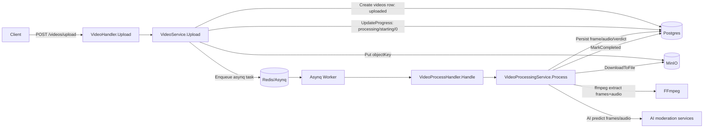

# Quy trình xử lý video & cập nhật trạng thái (Server)

Tài liệu này mô tả luồng xử lý video end-to-end trong service Go (upload → enqueue → worker xử lý → lưu kết quả), và cơ chế cập nhật `status/current_stage/progress_percent` trong DB.

---

## 1) Mô hình dữ liệu (DB) cho trạng thái video

Bảng `videos` lưu trạng thái tổng và tiến độ:

- `status`: trạng thái tổng quan (`uploaded|processing|completed|failed`).
- `current_stage`: stage chi tiết trong quá trình xử lý.
- `progress_percent`: phần trăm tiến độ.
- `uploaded_at`, `processed_at`: mốc thời gian upload / xử lý xong.

Dẫn chứng:

- Schema cột trạng thái/tiến độ trong migration: [migrations/002_videos.sql](../../migrations/002_videos.sql#L4-L15)
- Model mapping sang struct: [server/internal/model/video.go](../internal/model/video.go#L10-L24)

Các bảng kết quả moderation (persist ở bước aggregation):

- `final_verdicts`, `violation_segments`: [migrations/004_violation_segments.sql](../../migrations/004_violation_segments.sql), [migrations/005_slim_moderation_results.sql](../../migrations/005_slim_moderation_results.sql)

---

## 2) Định nghĩa `status`, `stage` và phần trăm tiến độ

### 2.1 `status` (high-level)

Định nghĩa status hợp lệ:

- `uploaded`, `processing`, `completed`, `failed`: [server/internal/constants/video_status.go](../internal/constants/video_status.go#L6-L10)

Ý nghĩa:

- `uploaded`: vừa tạo record + upload object lên MinIO xong (trạng thái ban đầu trong `Upload`).
- `processing`: đã được đưa vào hàng đợi xử lý (enqueue) và/hoặc worker đang chạy.
- `completed`: xử lý xong, có `processed_at`.
- `failed`: xử lý lỗi.

### 2.2 `stage` (fine-grained)

Định nghĩa các stage:

- `starting`, `frame_extraction`, `audio_extraction`, `video_analysis`, `audio_analysis`, `aggregation`, `completed`, `failed`: [server/internal/constants/video_stage.go](../internal/constants/video_stage.go#L6-L13)

Mapping stage → `progress_percent`:

- `starting=0`, `frame_extraction=15`, `audio_extraction=35`, `video_analysis=50`, `audio_analysis=65`, `aggregation=90`, `completed=100`: [server/internal/constants/video_stage.go](../internal/constants/video_stage.go#L16-L23)

Cơ chế tính progress:

- `VideoProgress.Update()` lấy `percent := StageProgress[stage]` rồi gọi `VideoRepository.UpdateProgress(..., status=processing, stage, percent)`: [server/internal/services/video_progress.go](../internal/services/video_progress.go#L20-L22)

---

## 3) Luồng API: upload & query status

### 3.1 Route

- Upload: `POST /api/v1/videos/upload`
- Danh sách: `GET /api/v1/videos`
- Lấy trạng thái: `GET /api/v1/videos/:id/status`
- Tải file: `GET /api/v1/videos/:id/download` (presigned URL, `Content-Disposition: attachment`)
- Xóa: `DELETE /api/v1/videos/:id` (MinIO object + DB, cascade verdict/segments)

Chi tiết request/response: [docs/API_REFERENCE.md](../../docs/API_REFERENCE.md).

Dẫn chứng: [server/internal/app/server_route.go](../internal/app/server_route.go)

### 3.2 Handler

- Upload nhận file form field `file` và gọi `VideoService.Upload(...)`: [server/internal/handlers/video_handler.go](../internal/handlers/video_handler.go#L30-L58)
- GetStatus parse `:id` và gọi `VideoService.GetStatus(...)`: [server/internal/handlers/video_handler.go](../internal/handlers/video_handler.go#L63-L85)

---

## 4) Luồng xử lý khi upload video (điểm bắt đầu của pipeline)

Toàn bộ logic upload nằm ở `VideoService.Upload()`:

1) Sinh `videoID`, suy ra `objectKey = videoID + ext` (mặc định `.mp4` nếu không có ext): [server/internal/services/video_service.go](../internal/services/video_service.go#L66-L72)
2) Tạo record `videos` với `Status=uploaded`, `ProgressPercent=0`, `CurrentStage=""`: [server/internal/services/video_service.go](../internal/services/video_service.go#L79-L90)
3) Upload nội dung lên MinIO: `store.Put(ctx, objectKey, ...)`:
  - Call site: [server/internal/services/video_service.go](../internal/services/video_service.go#L93-L96)
  - Implement MinIO put: [server/internal/pkg/minio.go](../internal/pkg/minio.go#L72-L80)
4) Chuyển sang trạng thái xử lý nền: set `status=processing`, `stage=starting`, `progress=0` bằng `UpdateProgress(...)`: [server/internal/services/video_service.go](../internal/services/video_service.go#L98-L100)
5) Enqueue task xử lý video: `enqueuer.EnqueueVideoProcess(videoID, objectKey)`: [server/internal/services/video_service.go](../internal/services/video_service.go#L102-L106)

Nếu upload MinIO hoặc enqueue thất bại, video bị mark `failed`:

- `_ = s.videos.MarkFailed(ctx, videoID)`: [server/internal/services/video_service.go](../internal/services/video_service.go#L93-L104)

---

## 5) Queue + Worker (asynq): nhận job và gọi service xử lý

### 5.1 Enqueue

Enqueuer tạo `asynq.Task` với payload `{video_id, object_key}` và đẩy vào queue với `MaxRetry` + `Timeout`:

- Tạo task payload: [server/internal/worker/task_type.go](../internal/worker/task_type.go#L17-L37)
- Enqueue + set queue/retry/timeout: [server/internal/queue/enqueuer.go](../internal/queue/enqueuer.go#L31-L52)

### 5.2 Worker handler

Worker handler parse payload rồi gọi `VideoProcessingService.Process(ctx, videoID, objectKey)`:

- Parse payload + gọi service: [server/internal/worker/video_handler.go](../internal/worker/video_handler.go#L16-L38)

### 5.3 Worker lifecycle

App khởi động cả worker và HTTP server song song:

- Worker start: [server/internal/app/app.go](../internal/app/app.go#L37-L45)
- Worker config (queue + concurrency) và `RegisterHandler`: [server/internal/app/worker.go](../internal/app/worker.go#L14-L44)
- Wire handler `TypeVideoProcess` → `VideoProcessHandler.Handle`: [server/internal/app/server_di.go](../internal/app/server_di.go#L106-L134)

---

## 6) Orchestrator: `VideoProcessingService.Process()` (download → process → persist)

`videoProcessingService.Process()` là nơi điều phối pipeline:

1) Update stage `starting` (đảm bảo status=processing, progress=0): [server/internal/services/video_processing_service.go](../internal/services/video_processing_service.go#L55-L58)
2) Download object từ MinIO về file tạm:

- Tạo file temp trong `tempDir` và giữ extension theo `objectKey`: [server/internal/services/video_processing_service.go](../internal/services/video_processing_service.go#L90-L112)
- Download object về file: [server/internal/services/video_processing_service.go](../internal/services/video_processing_service.go#L110-L114)
- Implement download MinIO: [server/internal/pkg/minio.go](../internal/pkg/minio.go#L83-L93)

3) Gọi processor (ffmpeg + AI): `s.processor.Process(ctx, job, s.progress)`:

- Call site: [server/internal/services/video_processing_service.go](../internal/services/video_processing_service.go#L71-L77)
- Nếu lỗi ở bước này: mark `failed`: [server/internal/services/video_processing_service.go](../internal/services/video_processing_service.go#L74-L77)

4) Update stage `aggregation` (progress=90): [server/internal/services/video_processing_service.go](../internal/services/video_processing_service.go#L79-L81)
5) Persist kết quả vào DB (`final_verdicts`, `violation_segments`): [server/internal/services/video_processing_service.go](../internal/services/video_processing_service.go)
6) Mark completed: [server/internal/services/video_processing_service.go](../internal/services/video_processing_service.go#L87-L88)

---

## 7) Processor chi tiết: ffmpeg extraction + AI moderation

Processor hiện tại là `ffmpegVideoProcessor`.

### 7.1 Stage update trong processor

- Stage `starting`: [server/internal/services/video_processor.go](../internal/services/video_processor.go#L51-L53)
- Stage `frame_extraction` & `audio_extraction` được set trong 2 goroutine song song (lưu ý: lỗi update stage bị bỏ qua bằng `_ = ...`):
  - Frame extraction stage: [server/internal/services/video_processor.go](../internal/services/video_processor.go#L80-L83)
  - Audio extraction stage: [server/internal/services/video_processor.go](../internal/services/video_processor.go#L86-L89)

### 7.2 Cắt frame (ffmpeg)

Lệnh ffmpeg trích xuất frame:

- Filter: `fps=1` kết hợp `select='gt(scene,0.3)+not(mod(n,10))'` (tức vừa dựa trên biến động scene vừa lấy mẫu theo frame index): [server/internal/services/video_processor.go](../internal/services/video_processor.go#L55-L63)
- Thực thi ffmpeg: gọi `utils.RunFFmpeg(args)` → `exec.Command("ffmpeg", ...)`: [server/internal/utils/ffmpeg.go](../internal/utils/ffmpeg.go#L10-L20)

Nếu frame extraction lỗi → fail toàn pipeline:

- `if framesErr != nil { return error }`: [server/internal/services/video_processor.go](../internal/services/video_processor.go#L92-L94)

### 7.3 Tách audio (ffmpeg)

Audio được xuất ra `audio.wav` cho faster-whisper:

- **Mono 16 kHz PCM s16le** — `pan=mono`, `aresample=16000:resampler=swr`
- `-fflags +genpts`, `-map 0:a:0?`: [server/internal/services/video_processor.go](../internal/services/video_processor.go)
- `video-api` chờ `image-moderation` **healthy** (model TensorFlow load xong, ~30–60s) trước khi nhận job: [docker-compose.yml](../../docker-compose.yml)

Nếu audio extraction lỗi → chỉ log, không fail job (pipeline vẫn tiếp tục):

- `if audioErr != nil { log ... }`: [server/internal/services/video_processor.go](../internal/services/video_processor.go#L95-L97)

### 7.4 AI moderation

Nếu `AIModerator` chưa cấu hình (nil) thì processor chỉ extraction và return luôn:

- `if p.ai == nil { return out, nil }`: [server/internal/services/video_processor.go](../internal/services/video_processor.go#L101-L104)

Nếu có AI:

- Stage `video_analysis` trước khi gửi frames: [server/internal/services/video_processor.go](../internal/services/video_processor.go#L106-L114)
- Stage `audio_analysis` chỉ chạy khi audio extraction OK (`if audioErr == nil { ... }`): [server/internal/services/video_processor.go](../internal/services/video_processor.go#L116-L128)

Chi tiết gọi AI:

- Frames moderation theo chunk + early-exit khi đủ flagged frames: [server/internal/services/ai_service.go](../internal/services/ai_service.go#L40-L118)
- Endpoint batch images: `FrameModeratorUrl + "/images/predict/batch"`: [server/internal/services/ai_service.go](../internal/services/ai_service.go#L156-L174)
- Audio moderation endpoint: `AudioModeratorUrl + "/audio/predict"`: [server/internal/services/ai_service.go](../internal/services/ai_service.go#L181-L231)

---

## 8) Aggregation & ghi kết quả vào DB

### 8.1 Xóa kết quả cũ (idempotent-ish)

Trước khi insert kết quả mới, service xóa kết quả cũ theo `video_id` (các lỗi xóa bị bỏ qua bằng `_ = ...`):

- [server/internal/services/video_processing_service.go](../internal/services/video_processing_service.go#L122-L124)

### 8.2 Build final verdict & transcript

- Verdict + transcript + peak scores tính in-memory từ AI output: [server/internal/services/video_moderation_mapper.go](../internal/services/video_moderation_mapper.go)

- `risk_score` = max(peak `nsfw`, peak `violence` từ frames, peak `Toxic` từ audio): [server/internal/services/video_moderation_mapper.go](../internal/services/video_moderation_mapper.go#L70-L121)
- Rule gộp verdict: frame `nsfw` → `nsfw`; frame `violence` hoặc audio `Toxic` → `violence`; còn lại → `safe`
- `violated = (verdict != "safe")` trong API status: [server/internal/dto/video_dto.go](../internal/dto/video_dto.go), [server/internal/services/video_service.go](../internal/services/video_service.go)
- Điều kiện “flagged frame” là label `nsfw` hoặc `violence`: [server/internal/dto/ai_moderation_dto.go](../internal/dto/ai_moderation_dto.go#L35-L37)
- Overall label cho frames: ưu tiên `nsfw` rồi `violence` rồi `safe`: [server/internal/dto/ai_moderation_dto.go](../internal/dto/ai_moderation_dto.go#L43-L58)

### 8.5 Violation time segments

- Visual: gộp frame flagged (`nsfw`/`violence`) thành khoảng `[start_sec, end_sec]` (~1s/frame + merge gap 1s): [server/internal/services/violation_segment_builder.go](../internal/services/violation_segment_builder.go)
- Audio: mỗi câu `Toxic` dùng `start_sec`/`end_sec` từ Whisper (API audio moderation trả kèm mỗi sentence)
- Lưu bảng `violation_segments`; migration: [migrations/004_violation_segments.sql](../../migrations/004_violation_segments.sql)

### 8.6 Persist

- Insert batch frames, audio, final verdict, violation segments: [server/internal/services/video_processing_service.go](../internal/services/video_processing_service.go)

---

## 9) Cơ chế cập nhật trạng thái (điểm “cập nhật DB” thực sự)

### 9.1 Update theo stage (processing)

Mọi cập nhật theo stage (trong lúc đang chạy) đều đi qua:

- `VideoProgress.Update()` → `VideoRepository.UpdateProgress(status=processing, current_stage=stage, progress_percent=StageProgress[stage])`: [server/internal/services/video_progress.go](../internal/services/video_progress.go#L20-L22)
- `VideoRepository.UpdateProgress(...)` update 3 cột: `status/current_stage/progress_percent`: [server/internal/repository/video_repository.go](../internal/repository/video_repository.go#L50-L56)

### 9.2 Mark failed

Khi fail, repository set:

- `status=failed`, `current_stage=failed`, `progress_percent=0`: [server/internal/repository/video_repository.go](../internal/repository/video_repository.go#L58-L64)

Các nơi gọi fail:

- Upload MinIO / enqueue lỗi: [server/internal/services/video_service.go](../internal/services/video_service.go#L93-L104)
- Processing pipeline lỗi download/process/persist: [server/internal/services/video_processing_service.go](../internal/services/video_processing_service.go#L60-L85)

### 9.3 Mark completed

Khi completed, repository set:

- `status=completed`, `current_stage=completed`, `progress_percent=100`, `processed_at=now`: [server/internal/repository/video_repository.go](../internal/repository/video_repository.go#L66-L76)

---

## 10) Trả trạng thái cho client

Client query `GET /videos/:id/status` nhận:

- `status`, `stage`, `progress_percent`, `uploaded_at`, `processed_at`… từ bảng `videos`: [server/internal/services/video_service.go](../internal/services/video_service.go#L115-L132)
- Nếu `status=completed` thì trả thêm `verdict` và `violation_segments` (khoảng thời gian vi phạm): [server/internal/services/video_service.go](../internal/services/video_service.go)

---

## 11) Sơ đồ luồng xử lý (tóm tắt)

---

## 12) Ghi chú hành vi quan trọng (để đọc status đúng)

- Stage có thể “nhảy” giữa `frame_extraction` và `audio_extraction` trong lúc 2 goroutine chạy song song; stage cuối cùng trong DB phụ thuộc goroutine nào update sau (tạm thời). Sau đó sẽ được set sang `video_analysis` / `audio_analysis` / `aggregation` theo thứ tự orchestrator/processor: [server/internal/services/video_processor.go](../internal/services/video_processor.go#L80-L128)
- Audio extraction fail không làm fail toàn job; status vẫn có thể `completed` nhưng thiếu segment audio / transcript: [server/internal/services/video_processor.go](../internal/services/video_processor.go)
