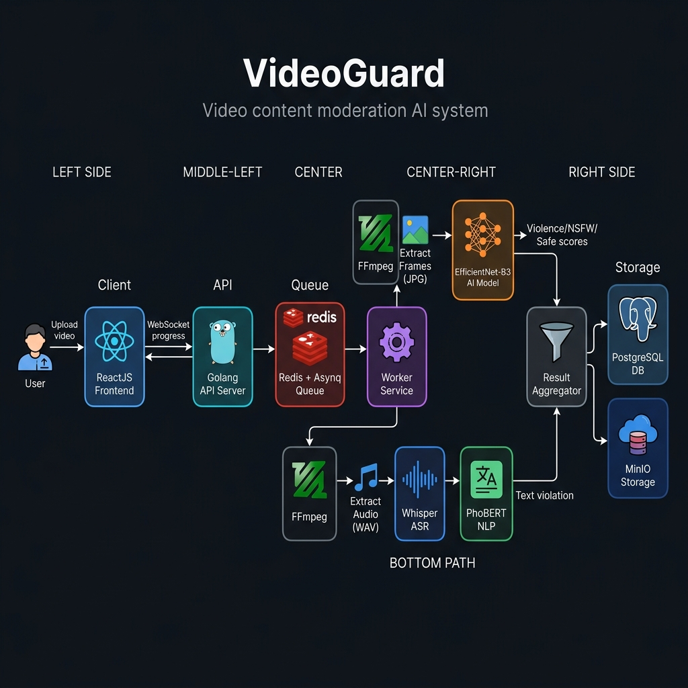
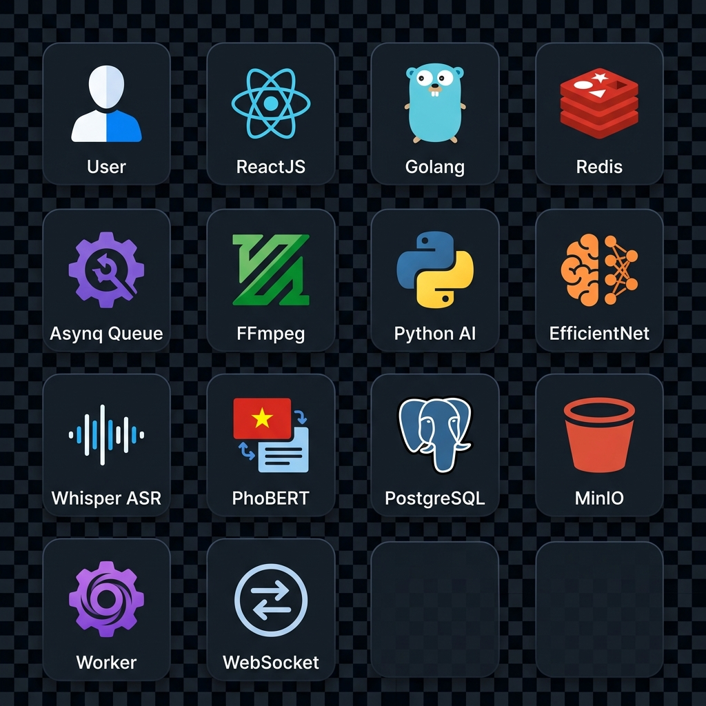
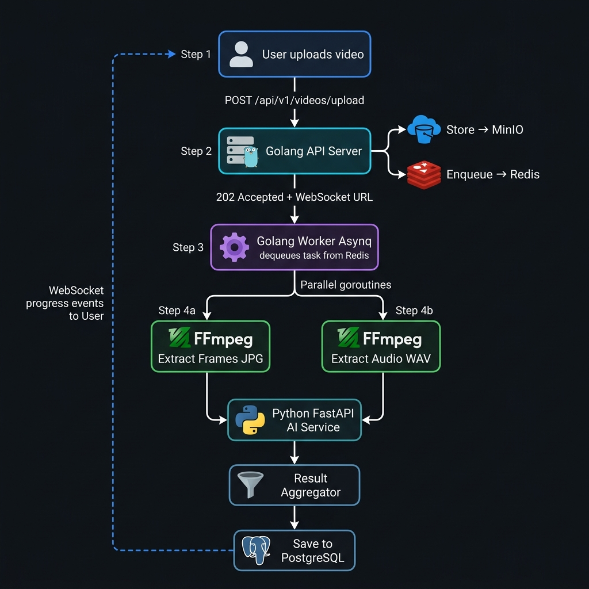
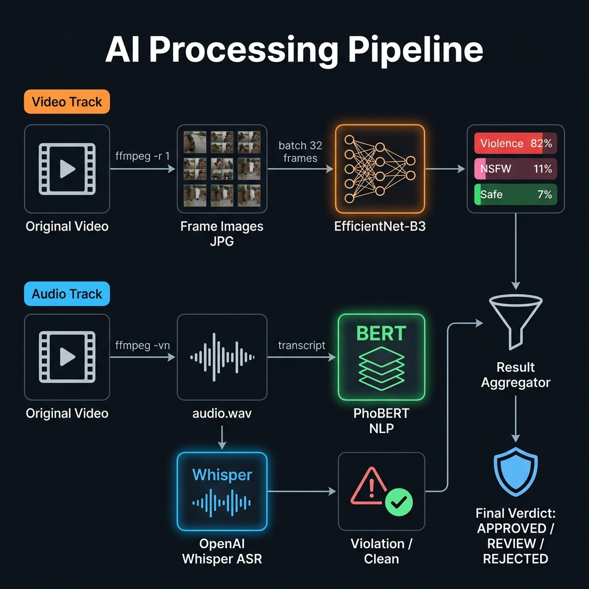
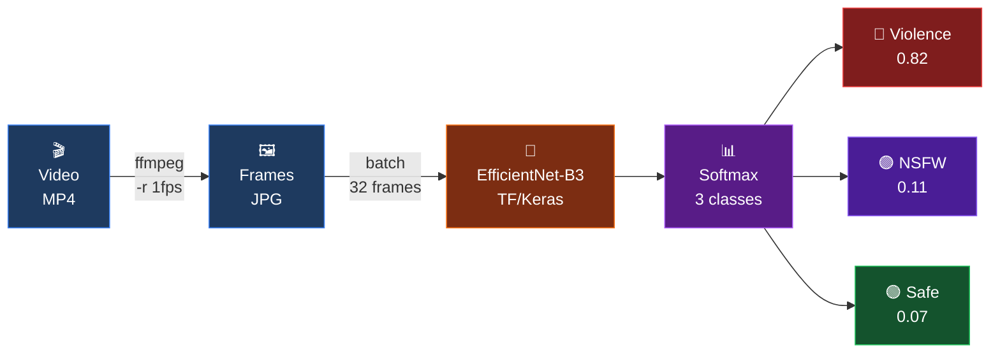
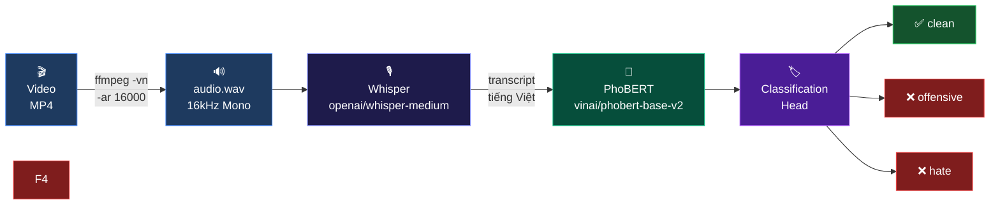
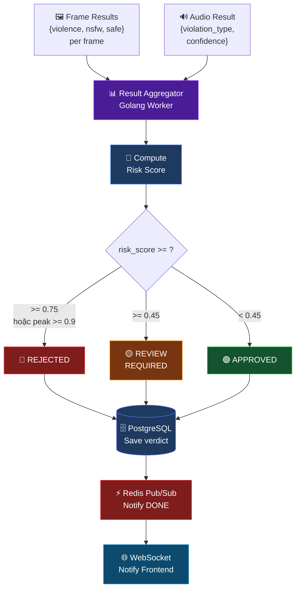
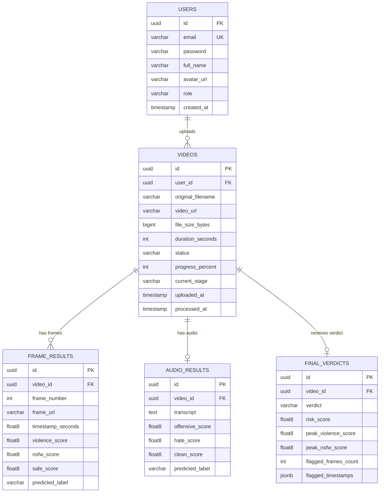
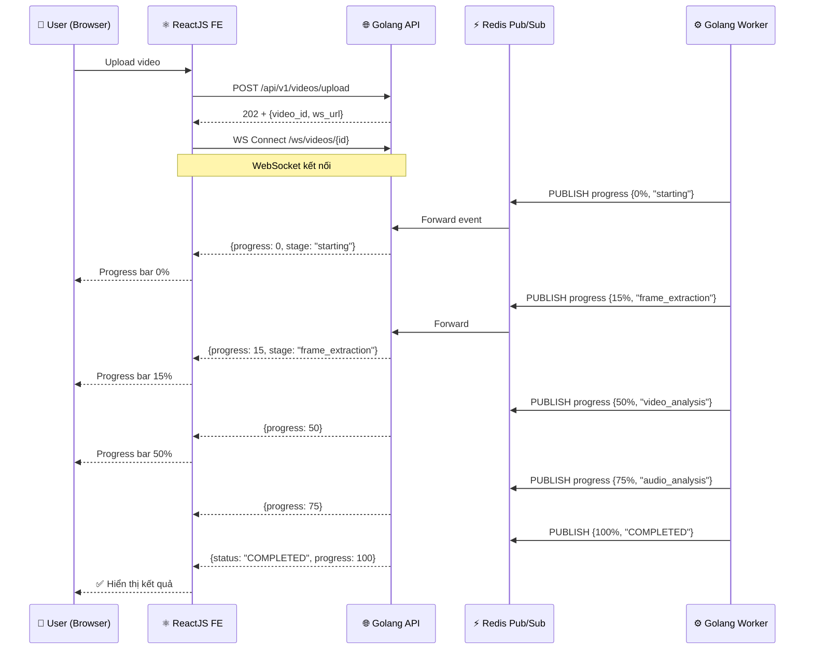
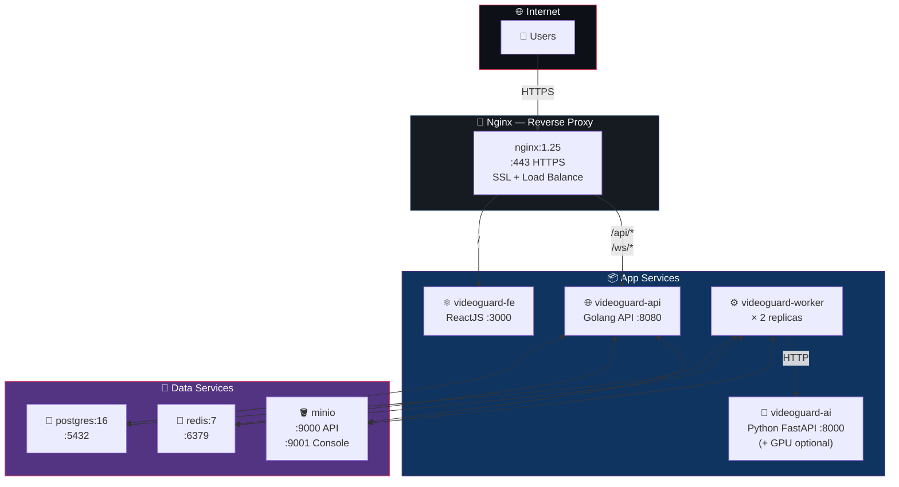

# 🛡️ VideoGuard — Kiến Trúc Hệ Thống

> Hệ thống phân tích & kiểm duyệt nội dung video tự động bằng AI

---

## 1. 🗺️ Tổng Quan Kiến Trúc



---

## 2. 🧩 Các Thành Phần Công Nghệ



| Layer | Công nghệ | Vai trò |
|-------|-----------|---------|
| 🖥️ **Frontend** |  | Giao diện upload + tracking tiến độ |
| 🌐 **API Server** |  | REST API + WebSocket server |
| ⚡ **Task Queue** |   | Hàng đợi job bất đồng bộ |
| ⚙️ **Worker** |  | Xử lý video nền |
| 🎬 **Media** |  | Tách frame ảnh + âm thanh |
| 🤖 **AI Service** |  | Inference server AI |
| 🧠 **Image AI** |  | Phân loại violence/NSFW/safe |
| 🎙️ **Speech AI** |  | Chuyển âm thanh → văn bản |
| 📝 **Text AI** |  | Phân tích văn bản tiếng Việt |
| 🗄️ **Database** |  | Lưu metadata + kết quả |
| 🪣 **Storage** |  | Lưu video, frame, audio |

---

## 3. 🔄 Luồng Xử Lý Bất Đồng Bộ



### Giải thích từng bước:

```
👤 User                  🌐 Golang API            ⚡ Redis Queue
   │                          │                         │
   │── POST /upload ─────────▶│                         │
   │                          │── PUT video ──▶ 🪣 MinIO│
   │                          │── INSERT ──────▶ 🗄️ PG  │
   │                          │── ENQUEUE ─────────────▶│
   │◀── 202 Accepted ─────────│                         │
   │                          │                         │
   │                    ⚙️ Worker ◀── DEQUEUE ──────────│
   │                          │
   │         ┌────────────────┴────────────────┐
   │         │  Parallel goroutines              │
   │         ▼                                  ▼
   │   🎬 FFmpeg                          🎬 FFmpeg
   │   Extract Frames                     Extract Audio
   │         │                                  │
   │         ▼                                  ▼
   │   🧠 EfficientNet                   🎙️ Whisper ASR
   │   (Violence/NSFW/Safe)              (Audio → Text)
   │         │                                  │
   │         │                           📝 PhoBERT
   │         │                           (Text classify)
   │         └────────────────┬────────────────┘
   │                          ▼
   │                   📊 Result Aggregator
   │                          │
   │                          ├──▶ 🗄️ PostgreSQL
   │                          └──▶ ⚡ Redis Pub/Sub
   │                                      │
   │◀── WebSocket Progress ───────────────┘
```

---

## 4. 🤖 Pipeline Xử Lý AI



### 4.1 🎥 Video Track — EfficientNet-B3




### 4.2 🎙️ Audio Track — Whisper + PhoBERT



---

### 4.3 📊 Tổng Hợp Kết Quả — Result Aggregator



<!-- **Công thức tính Risk Score:**

```
risk_score = 0.35 × avg_violence
           + 0.25 × avg_nsfw
           + 0.25 × audio_confidence × (1.5 nếu vi phạm, 1.0 nếu không)
           + 0.15 × peak_violence
```

--- -->

## 5. 🗄️ Cơ Sở Dữ Liệu



---

## 6. 📡 WebSocket — Tracking Tiến Độ Thời Gian Thực



### Progress Stages

| % | Stage | Mô tả |
|---|-------|-------|
| 0% | `starting` | Worker bắt đầu xử lý |
| 15% | `frame_extraction` | FFmpeg đang tách frame |
| 20–50% | `audio_extraction` | FFmpeg tách audio |
| 50% |  `video_analysis` | EfficientNet phân tích từng frame |
| 50–75% | `audio_analysis` | Whisper + PhoBERT xử lý |
| 90% | `aggregation` | Tổng hợp kết quả |
| 100% | `completed` | Hoàn tất, lưu DB |

---

## 7. 🗂️ Cấu Trúc Lưu Trữ MinIO

```
🪣 Bucket: videoguard
│
└── 📁 videos/
    └── 📁 {video_id}/               ← UUID mỗi video
        ├── 🎬 original.mp4           ← File gốc người dùng upload
        ├── 🔊 audio.wav              ← Audio tách ra bởi FFmpeg
        └── 📁 frames/
            ├── 🖼️ frame_0001.jpg    ← Frame tại t=1s
            ├── 🖼️ frame_0002.jpg    ← Frame tại t=2s
            ├── 🖼️ frame_0003.jpg    ← Frame tại t=3s
            └── ...
```

**Lifecycle Policies:**
- 🔒 Bucket **không public** — truy cập qua pre-signed URL (TTL 10 phút)
- 🗑️ Frame images tự động xóa sau **7 ngày**
- 💾 Original video giữ lại theo policy người dùng

---

## 8. 🚀 Deployment (Docker Compose)



---

## 9. 🔌 API Reference

### REST Endpoints

| Method | Endpoint | Mô tả |
|--------|----------|-------|
| `POST` | `/api/v1/videos/upload` | Upload video mới |
| `GET` | `/api/v1/videos` | Danh sách video của user |
| `GET` | `/api/v1/videos/:id` | Chi tiết + trạng thái |
| `GET` | `/api/v1/videos/:id/result` | Báo cáo kiểm duyệt đầy đủ |
| `GET` | `/api/v1/videos/:id/frames` | Danh sách frame results |
| `DELETE` | `/api/v1/videos/:id` | Xóa video |
| `WS` | `/ws/videos/:id` | WebSocket real-time progress |
| `GET` | `/api/v1/health` | Health check |

<!-- ### WebSocket Message Format

```json
{
  "event": "progress_update",
  "video_id": "550e8400-...",
  "status": "PROCESSING",
  "progress": 50,
  "current_stage": "video_analysis",
  "stages": {
    "upload":           "completed",
    "frame_extraction": "completed",
    "video_analysis":   "in_progress",
    "audio_extraction": "pending",
    "audio_analysis":   "pending",
    "aggregation":      "pending"
  }
}
```

### Final Result Response

```json
{
  "video_id": "550e8400-...",
  "verdict": "REJECTED",
  "risk_score": 0.87,
  "summary": {
    "total_frames": 120,
    "flagged_frames": 23,
    "peak_violence": 0.94,
    "audio_violation": true,
    "audio_type": "threat",
    "flagged_timestamps": [1.5, 3.2, 7.8, 12.1]
  }
}
```

--- -->

> 📅 VideoGuard System Architecture v1.0 — 2026-04-14
